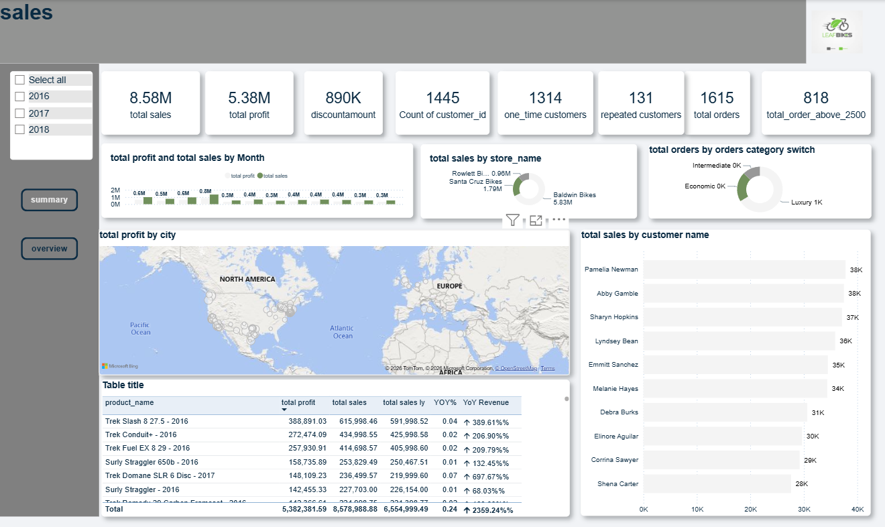
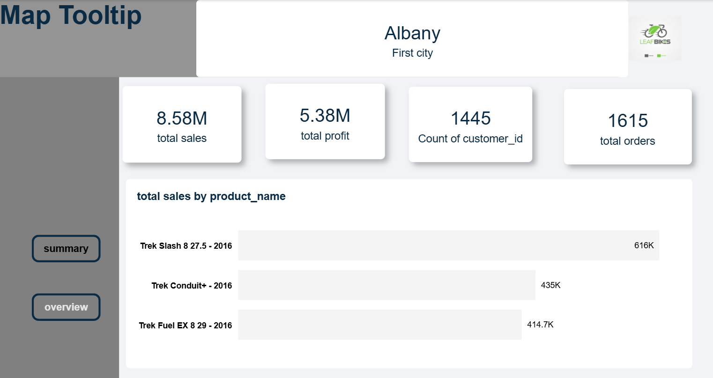
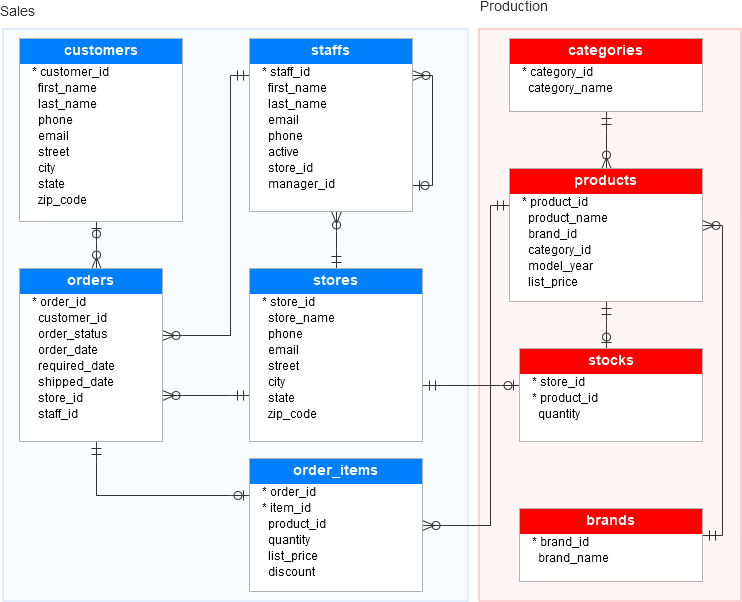

# 🚴 Bike Store Sales Analytics Dashboard

An end-to-end Business Intelligence project built using SQL Server and Power BI to analyze bike store sales performance.

The project demonstrates the complete analytics workflow starting from raw CSV files, designing the SQL Server database, querying the data, and building an interactive Power BI dashboard.

---

# 📌 Project Overview

This project analyzes a retail bike store dataset to provide valuable business insights regarding:

- Sales Performance
- Profit Analysis
- Customer Behavior
- Store Performance
- Product Performance
- Year-over-Year Growth

The solution combines SQL Server for data storage and querying with Power BI for interactive visualization.

---

# 🛠 Technologies Used

- SQL Server
- Power BI
- DAX
- SQL
- Power Query

---

# 📂 Dataset

The dataset consists of multiple CSV files representing a relational database.

Tables include:

- Customers
- Orders
- Order Items
- Products
- Categories
- Brands
- Stores
- Staffs
- Stocks

---

# ⚙️ Project Workflow

### 1. Data Preparation

- Imported CSV files into SQL Server
- Created relational database
- Established primary and foreign key relationships

---

### 2. SQL Analysis

- Data extraction
- Data transformation
- Business queries
- Aggregations
- KPI calculations

---

### 3. Power BI Development

Connected Power BI directly to SQL Server and created an interactive dashboard featuring:

- KPI Cards
- Sales Analysis
- Profit Analysis
- Customer Analysis
- Store Performance
- Product Analysis
- Year-over-Year Analysis
- Interactive Filters
- Drill Through
- Map Visualization
- Tooltip Pages

---

# 📊 Dashboard Features

✔ Total Sales

✔ Total Profit

✔ Orders Analysis

✔ Customer Analysis

✔ Store Performance

✔ Product Performance

✔ Interactive Slicers

✔ Map Visualization

✔ Drill Through

✔ Tooltip Pages

✔ Dynamic KPIs

✔ Year-over-Year Analysis

---

# 📷 Dashboard Preview

## Main Dashboard

---

## Tooltip Page

---

## Database Schema

---

# 📈 Key Business Insights

- Identified top-performing products.
- Compared sales across stores.
- Measured customer purchasing behavior.
- Evaluated yearly sales growth.
- Monitored sales and profitability using interactive KPIs.

---

# 🚀 Skills Demonstrated

- SQL Server Database Design
- Data Modeling
- SQL Querying
- Data Analysis
- Business Intelligence
- Power BI Dashboard Development
- DAX Measures
- Data Visualization
- KPI Reporting
- Interactive Dashboard Design

---

# 👤 Author

**Mohamed Gamal**

LinkedIn:
https://www.linkedin.com/in/mohamed-gamal-eldeen/

GitHub:
https://github.com/mo7amedgamal2
